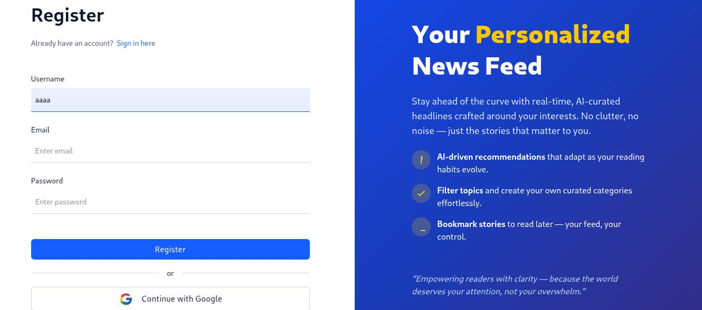
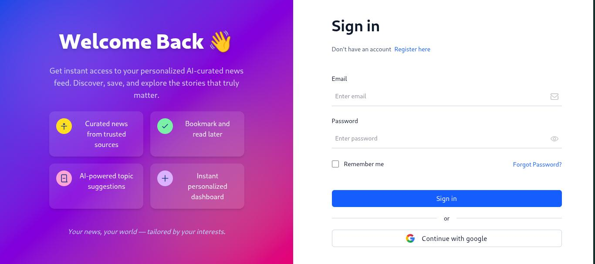
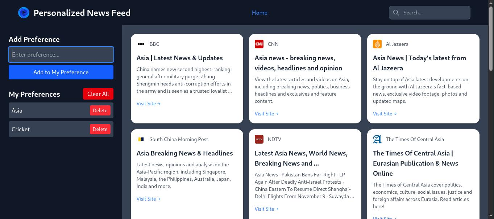
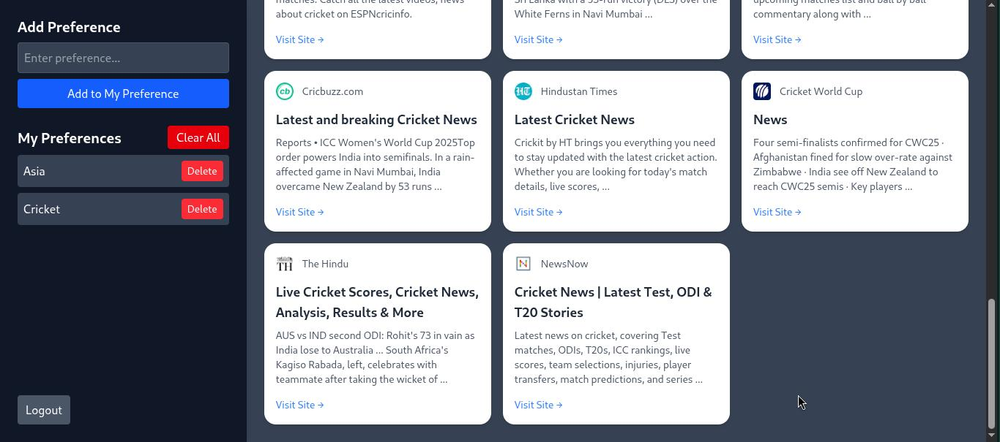

# 📰 HUD – Personalized News Feed

> “Your personalized window to the world of news.” 🌍 
> A modern, intelligent news platform that curates headlines you actually care about — powered by **Flask**, **React**, and **SerpApi**.

---
## 🎥 Project Preview





---


## ✨ Overview

**HUD (Hyper User Dashboard)** is a personalized news feed web app that delivers real-time news tailored to user preferences.  
It integrates with **SerpApi** to fetch live articles from Google News and presents them beautifully through a **Vite + React** frontend with **Flask** as the backend API.

---

## 🚀 Features

- 🔍 Personalized, category-based news recommendations  
- 📰 Real-time data from **Google News** via **SerpApi**  
- ⚡ Lightning-fast frontend powered by **React + Vite**  
- 🎨 Responsive UI with **Tailwind CSS**  
- 🧠 Flask backend for robust API handling  
- 🧩 Modular, developer-friendly structure  

---


## ⚙️ Installation & Setup

### 🔧 1️⃣ Clone the Repository
```bash
git clone https://github.com/<your-username>/HUD-Personalized-News-Feed-.git
cd HUD-Personalized-News-Feed-


🐍 2️⃣ Backend Setup
cd backend
pip install -r requirements.txt
python server.py


⚛️ 3️⃣ Frontend Setup
cd client
npm install
npm run dev


Then open your browser at http://localhost:8000

🧠 Tech Stack
| Layer        | Technology                |
| :----------- | :------------------------ |
| **Frontend** | React, Vite, Tailwind CSS |
| **Backend**  | Flask (Python)            |
| **API**      | SerpApi (Google News API) |
| **Database** | SQLite / MySQL (optional) |
| **Tools**    | Postman, Git, VS Code     |

💡 Future Enhancements

🤖 AI-based article recommendation using NLP
🌍 Multi-language support
🔔 Real-time push notifications for trending topics
📊 User analytics dashboard


🧭 Folder Structure
HUD-Personalized-News-Feed-
├── backend/
│   ├── server.py
│   ├── requirements.txt
│   └── ...
├── client/
│   ├── src/
│   ├── public/
│   ├── package.json
│   └── vite.config.js
└── README.md


